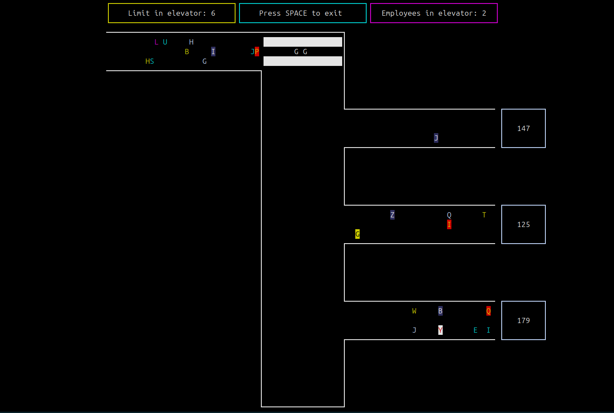

# Office

## Description

"Office" is a C++ application designed to showcase the utilization and management of threads in a modern C++ environment. This project serves as an educational tool for developers interested in learning about concurrent programming in C++ using threads. By leveraging the capabilities of C++ threads, "Office" demonstrates efficient task management and execution in software development.

## Table of Contents

- [Installation](#installation)
- [Running the Application](#running-the-application)
- [Licence](#licence)
- [Screenshots](#Screenshot)
  
## Installation

The "Office" application requires certain tools and libraries to be installed on your system. Follow these steps to set up your development environment:

### Prerequisites

Ensure your system is up-to-date and has the necessary compilers and libraries installed.

```bash
sudo apt update
sudo apt install g++ make libncurses5-dev libncursesw5-dev
```

### Clone and Compile
Clone the repository and compile the application using make.

```bash
git clone https://github.com/piotrszczypior/office
cd office
make
```

### Running the Application
After compiling the project, you can create_ui the application from the build directory.

```bash
cd build
./office
```

## Screenshot



## Licence

This version includes improvements such as:
- A more detailed description of the project and its educational purpose.
- A clarified and expanded installation guide, including prerequisites.
- A separate section for running the application, making it clear and easy to follow.
- Placeholder sections for features, contributing, and licensing to encourage community involvement and legal clarity.

Remember to replace placeholders (like `https://github.com/piotrszczypior/office` and the project name in the running instructions) with the actual data relevant to your project.
